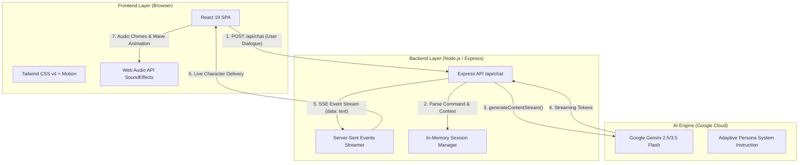
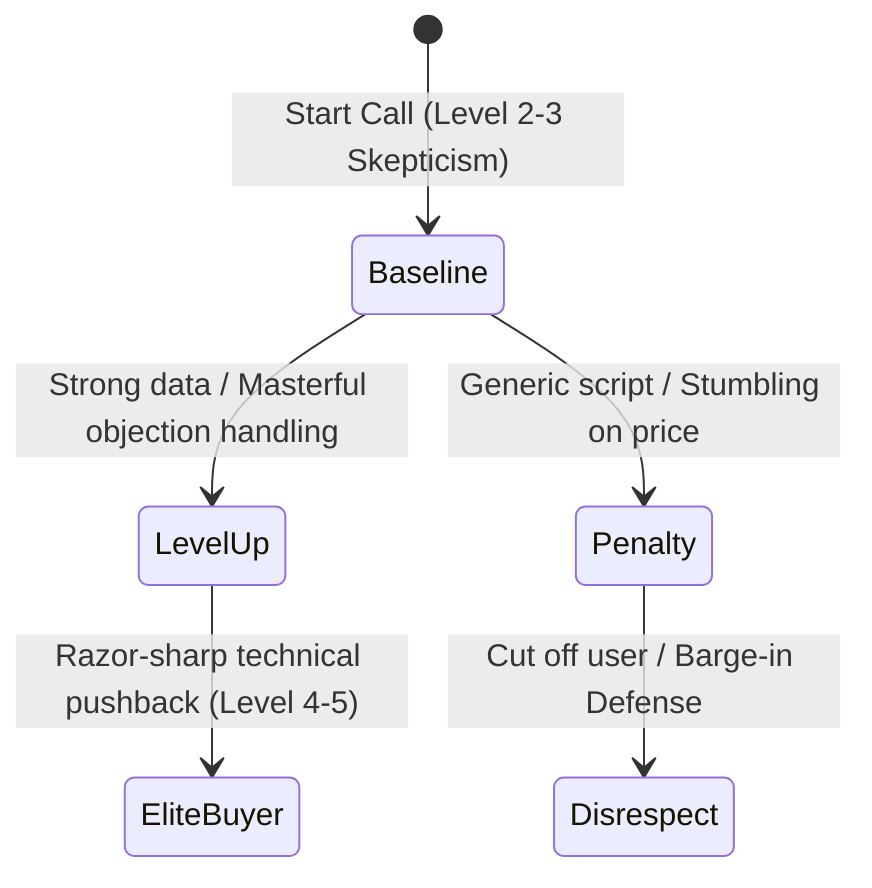

# 🏛️ System Architecture & Technical Deep-Dive
**AI B2B Sales Training Simulator**  
*An Adaptive Conversational Roleplay & Evaluation Platform Powered by Google Gemini*

---

## 1. Executive Summary (For Non-Technical Stakeholders)

The **AI B2B Sales Training Simulator** is an interactive web application designed to train, test, and evaluate sales representatives in realistic cold and warm calling environments. 

Instead of relying on scripted chat bots, the system utilizes an advanced Generative AI engine (Google Gemini) instructed to act as a Skeptical Business Owner. The AI listens to the salesperson's pitch, dynamically adjusts its resistance level based on the quality of their arguments, and delivers a rigorous, unbiased performance evaluation ("Report Card") at the end of the call.

### 🌟 Why This Matters for Business
* **Risk-Free Practice:** Reps practice objection handling against an AI prospect before speaking to real, high-value clients.
* **Objective Grading:** Eliminates bias by grading reps across metrics like *Objection Survival*, *Product Accuracy*, and *Closing Effectiveness*.
* **Real-Time Responsiveness:** Emulates natural phone call cadence with real-time text streaming and audio feedback.

---

## 2. Full Technology Stack (For Technical Engineers)

The application is engineered as a **Full-Stack Monolithic Node.js/TypeScript Application** combining an Express API server with an ultra-responsive React Single Page Application (SPA).

### 🧰 Core Tech Stack Table

| Component | Technology | Version | Architectural Role |
| :--- | :--- | :--- | :--- |
| **Frontend Framework** | React + Vite | `19.0.1` / `6.2.3` | Handles client UI, live chat transcripts, state management, and wave visualizers. |
| **Styling & Animation** | Tailwind CSS + Motion | `4.1.14` / `12.23.24` | Modern glassmorphic aesthetics, responsive layouts, and smooth micro-animations. |
| **Backend Framework** | Node.js + Express | `4.21.2` | Manages AI session history, parses triggers, and streams LLM output to the client. |
| **AI Integration** | Google Gen AI SDK (`@google/genai`) | `2.4.0` | Communicates directly with Gemini Flash models using structured system prompts. |
| **Real-Time Transport** | Server-Sent Events (SSE) | HTTP/1.1 Chunked | Streams token-by-token responses with minimal latency without WebSocket overhead. |
| **Language & Build** | TypeScript + ESBuild | `5.8.2` | Ensures full type safety from client components down to API payloads. |

---

## 3. Core Architectural Modules & Data Flow

### A. The State-Switching & Persona Trigger Engine
When a call begins, the backend inspects the salesperson's initial opening line for case-insensitive keyword triggers (e.g., `"solar"`, `"plumbing videos"`, `"roofing social pro"`). 
* **Dynamic Injection:** The server prepends a hidden contextual tag to the prompt payload sent to Gemini, forcing the model to adopt the corresponding business owner persona (**Mike** for Solar; **Rick** for Trades/HVAC/Roofing).
* **Randomized Archetypes:** The AI secretly selects one of three psychological profiles:
  1. *The Skeptical Veteran* (burnout from marketing agencies).
  2. *The Overwhelmed Operator* (short attention span, on a noisy job site).
  3. *The Analytical Buyer* (fixated on logistics, APIs, and refund policies).

### B. Adaptive Difficulty Engine (Level 2 to Level 5)

* **Level-Up Trigger:** If the salesperson validates pain points effectively, the AI elevates its difficulty mid-call, introducing advanced technical pushback.
* **Barge-In Defense:** The system instruction commands the AI to interrupt the user if their prompt resembles a rehearsed script.

### C. Server-Sent Events (SSE) Streaming Layer
To simulate a real human speaking on the phone, responses are never delivered as static text blocks:
1. The backend invokes `ai.models.generateContentStream()`.
2. As Gemini emits raw token chunks, the Express server writes formatted SSE headers (`text/event-stream`) and pushes chunks (`data: {"text": "..."}\n\n`) to the client.
3. The React client progressively renders the text while animating the voice visualizer.

### D. Automated Graded Assessment Report Card
Upon detecting call termination (e.g., *"The call has ended"* or a mutual goodbye), the AI drops character and emits a structured Markdown block:
* **Final Rating:** A, B, C, D, or F
* **Screening Verdict:** `[HIRE / DO NOT HIRE]`
* **Coaching Analysis:** A concise 2-sentence tactical sales breakdown.

---

## 4. Deployment Architecture

The application is deployed as a **Unified Production Bundle** on **Render.com**:
* **Build Process:** Vite compiles and minifies the React SPA into `/dist`, while `esbuild` bundles `server.ts` into a self-contained `/dist/server.cjs` script.
* **Runtime Serving:** In production (`NODE_ENV="production"`), Express serves static assets from `/dist` and routes `/api/chat` requests to the AI engine, ensuring zero CORS friction and simplified single-domain SSL hosting.
